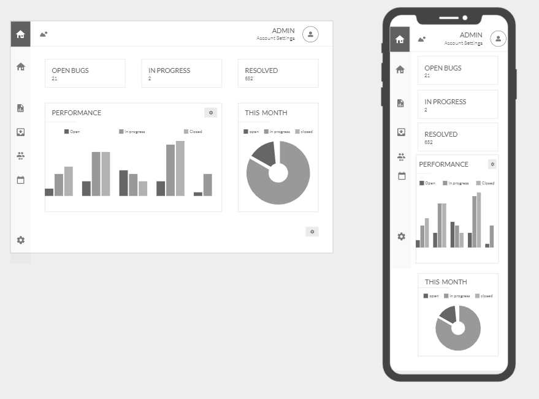
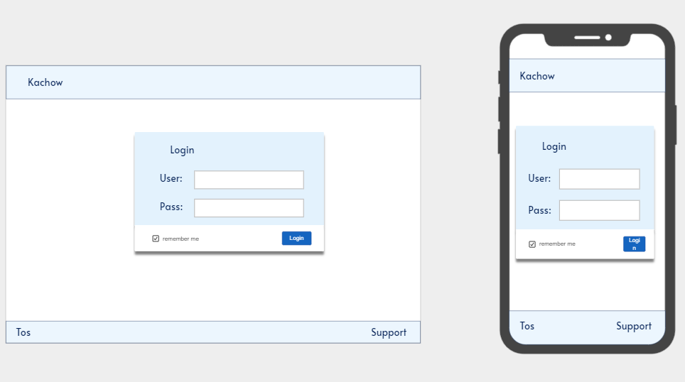
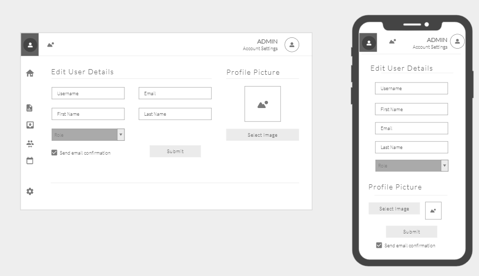

# Overview
This project was created with the purpose to provide tech companies with an interface for managing and tracking the bugs within their projects. On login users will be presented with an overview dashboard. 

From there users can use the console to access various pages. One of the pages will allow users to view/submit/manage bugs (mark them as closed or open). The other pages such as the calendar page will serve as a compliment allowing the users to see a calendar for when bugs were submitted and squashed. Users will be able to edit their profile information and are able to upload profile pictures to represent themselves. 

The page where bugs are submitted will allow comments and collaboration between users and attachments are able to be submitted. 
Admins will be able to create new users and allocate them roles and teams. Users will be able to track their own performance and contributions from their personalised page.

# Wireframes
Dashboard:

Login:

Settings:

##### email and role is uneditable from this page