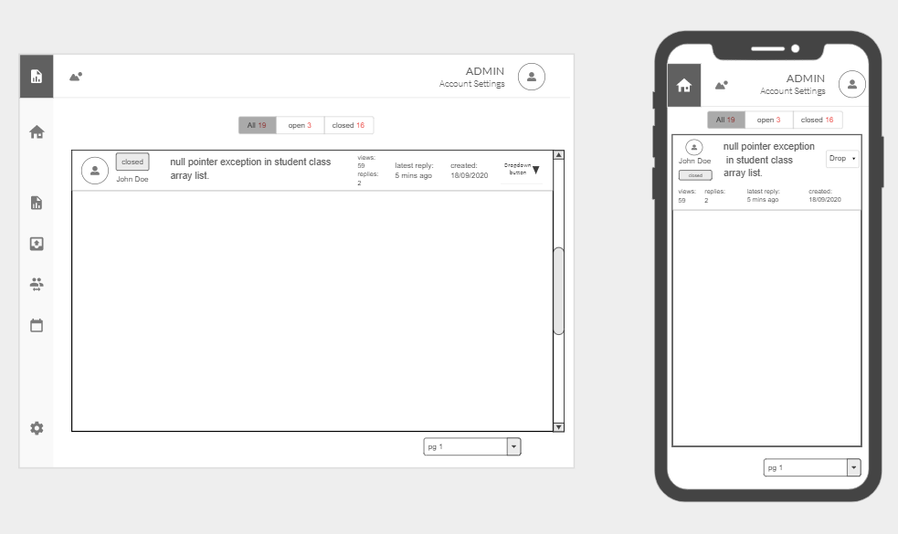
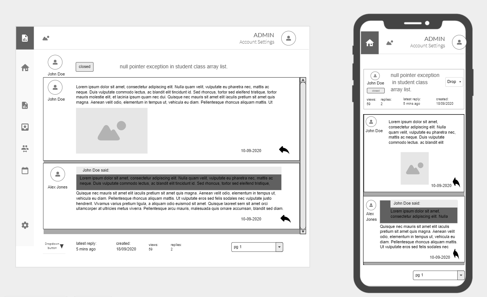
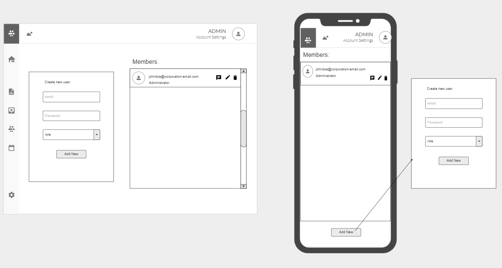
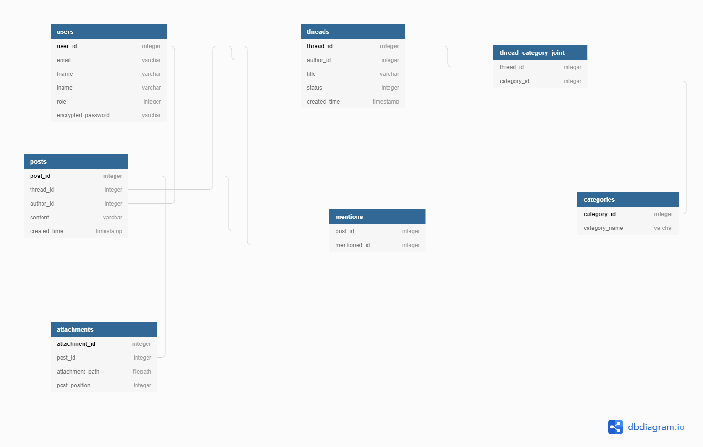

# Overview
This project was created with the purpose to provide tech companies with an interface for managing and tracking the bugs within their projects. On login users will be presented with an overview dashboard. 

From there users can use the console to access various pages. One of the pages will allow users to view/submit/manage bugs (mark them as closed or open). The other pages such as the calendar page will serve as a compliment allowing the users to see a calendar for when bugs were submitted and squashed. Users will be able to edit their profile information and are able to upload profile pictures to represent themselves. 

The page where bugs are submitted will allow comments and collaboration between users and attachments are able to be submitted. 
Admins will be able to create new users and allocate them roles and teams. Users will be able to track their own performance and contributions from their personalised page.

A swagger file is available in the docs folder to document the api.

# Installation instructions
The app makes use of the venv pip package to create a virtual environment. Therefore the package will need to be installed in order to run the app. There after the install instructions are as below:

- Clone the repo
```git clone github.com/mo-ccc/kachow.git```
- Change Directory into the src folder
```cd kachow/src```
- Make sure venv is installed then run:
```sudo apt-get install python3-venv```
- Create the virtual environment:
```python3 -m venv venv```
- Activate the virtual environment:
```source venv/bin/activate```
- Update pip
```pip install --upgrade pip```
- Install the dependencies from requirments.txt: 
```pip install -r requirements.txt```
- clone the .env.example file as a new file named .env
```cp .env.example .env```
- replace the already filled fields with your own
- export the FLASK_APP environment variable to main.py
```export FLASK_APP=main.py```
- export the FLASK_ENV environment variable to production
```export FLASK_ENV=production```
- run gunicorn on the port of your choice
```gunicorn -b 0.0.0.0:{port} "main:create_app"```

# Wireframes
**Dashboard:**
Displays graphics related to the number of bugs. Menu options on the left allow the user to access different pages. clicking user profile in top right allows them to edit their settings. Notifications may also be displayed on this page.


**Login:**


**Settings:**

##### email and role is uneditable from this page

**Threads:**
Page containing all thread elements. the menu buttons filter which threads are displayed.


**Single Thread:**
Page for viewing a single thread. Posts are made here. at the end of the page a form will take user input to add replies to the thread. replies can contain quote blocks and will notify the replied to.


**Admin management page:**
Page that only the admins can view. Will allow them to create and remove accounts as well as edit roles and details of pre-existing accounts.


# Class Diagram


The dbdiagram is accessible from this link.
https://dbdiagram.io/d/5fa4f1853a78976d7b7ac333

# Swagger API
https://petstore.swagger.io/?url=https://raw.githubusercontent.com/mo-ccc/kachow/master/docs/swagger%20kachow.yaml#/